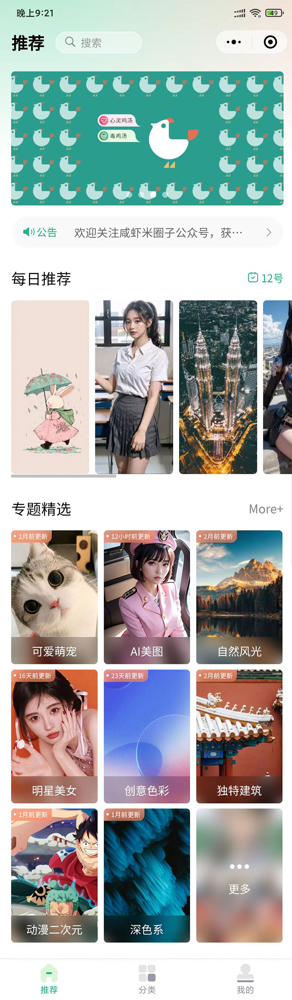
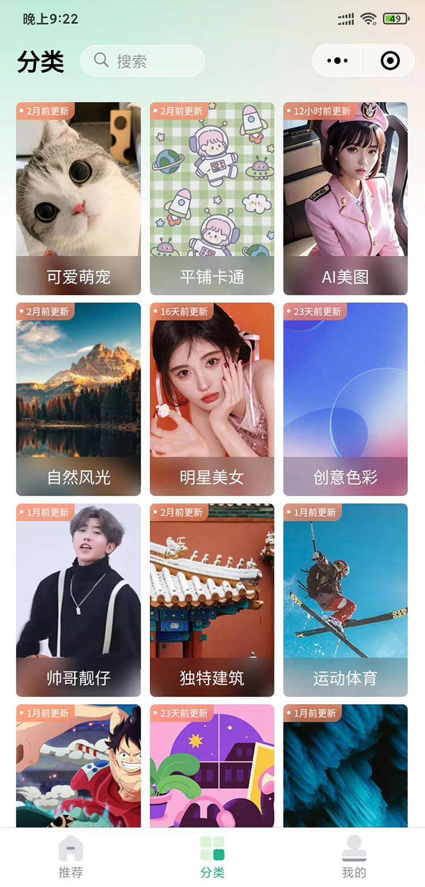
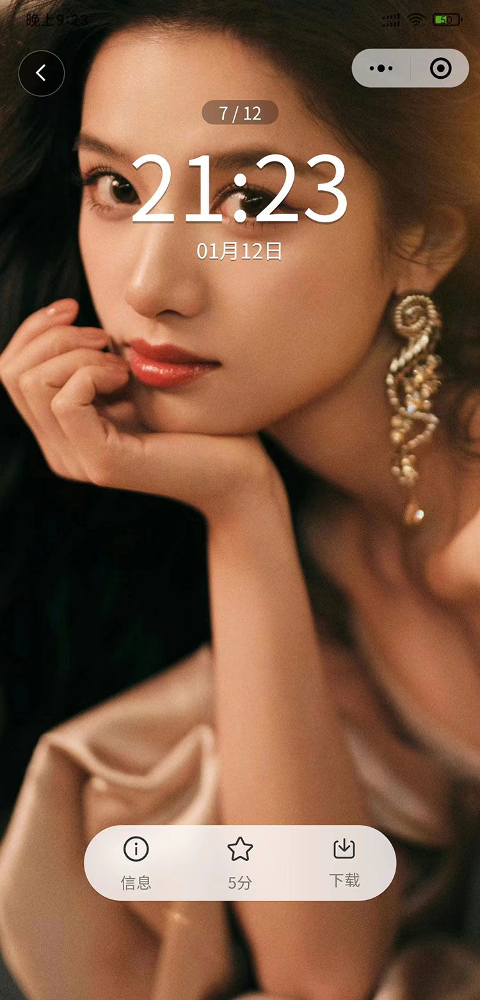
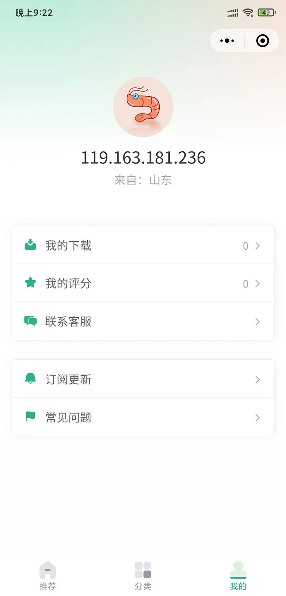

> 一个基于 UniApp (Vue3) 的跨端壁纸应用，支持微信小程序、抖音小程序、H5、App 等多端运行。

## 项目简介

一个功能完善的跨端壁纸应用，提供壁纸浏览、搜索、分类、专题、排行榜、评分、下载等功能。项目采用 Vue3 Composition API 开发，通过条件编译实现一套代码多端运行，是学习 UniApp 跨端开发的优秀实践项目。

## 功能特性

### 核心功能

- **首页推荐**：Banner 轮播、公告滚动、每日推荐、分类精选、专题推荐
- **分类浏览**：分类网格展示、分类列表触底加载
- **专题系统**：专题卡片（旋转拼图效果）、专题详情（毛玻璃背景）
- **搜索功能**：关键词搜索、历史记录管理、热门推荐
- **壁纸预览**：Swiper 全屏滑动、信息弹窗、评分弹窗、下载保存
- **排行榜**：下载榜/评分榜双 Tab、日期范围选择
- **近期上新**：最新壁纸展示、广告位动态插入
- **用户中心**：IP 地址展示、下载/评分统计、联系客服

### 技术亮点

- **多端适配**：通过条件编译实现微信/抖音/H5/App 差异化处理
- **自定义导航栏**：动态计算状态栏/标题栏高度，适配刘海屏/全面屏
- **图片预加载**：前后三张预加载策略，优化内存占用与滑动体验
- **本地缓存通道**：使用 Storage 实现页面间大数据传递
- **请求封装**：统一错误码处理、Toast/Modal 分流提示
- **骨架屏优化**：uv-skeletons 实现首屏 loading 体验
- **广告位插入**：内容流中动态插入广告组件

## 技术栈

| 技术 | 说明 |
|------|------|
| UniApp | 跨端开发框架 |
| Vue3 | 渐进式 JavaScript 框架 |
| Composition API | Vue3 组合式 API |
| SCSS | CSS 预处理器 |
| uni_modules | UniApp 插件生态 |

### 主要插件

- `mp-html` - 富文本渲染
- `uni-search-bar` - 搜索栏组件
- `uni-load-more` - 加载更多组件
- `uni-rate` - 评分组件
- `uni-datetime-picker` - 日期时间选择器
- `uv-skeletons` - 骨架屏组件
- `uv-empty` - 空状态组件

## 项目结构

```
wallPaper/
├── pages/                          # 主包页面
│   ├── index/index.vue             # 首页
│   ├── classify/classify.vue       # 分类页
│   ├── classlist/classlist.vue     # 分类列表
│   ├── preview/preview.vue         # 壁纸预览（核心页面）
│   ├── subject/subject.vue         # 专题列表
│   ├── subject/detail.vue          # 专题详情
│   ├── search/search.vue           # 搜索页
│   ├── notice/notice.vue           # 公告列表
│   ├── notice/detail.vue           # 公告详情
│   └── user/user.vue               # 用户中心
├── pages_quick/                    # 分包页面（按需加载）
│   ├── ranking.vue                 # 排行榜
│   └── news.vue                    # 近期上新
├── components/                     # 公共组件
│   ├── custom-nav-bar/             # 自定义导航栏
│   ├── common-title/               # 标题组件
│   ├── picture-item/               # 图片项组件
│   ├── theme-item/                 # 主题项组件
│   └── subject-item/               # 专题卡片组件
├── utils/                          # 工具函数
│   ├── request.js                  # 请求封装
│   ├── system.js                   # 系统信息（状态栏/导航栏）
│   ├── layout.js                   # 布局计算（安全区/胶囊按钮）
│   ├── common.js                   # 公共函数（路由/Toast）
│   └── tools.js                    # 工具函数（格式化）
├── api/                            # API 接口
│   └── apis.js                     # 所有接口定义
├── common/                         # 公共资源
│   ├── style/                      # 样式文件
│   │   ├── base-style.scss         # 基础变量
│   │   └── common-style.scss       # 全局样式
│   └── wallpaper/                  # 静态图片
├── static/                         # 静态资源
│   └── images/                     # 图片资源
├── uni_modules/                    # UniApp 插件
├── pages.json                      # 页面路由配置
├── manifest.json                   # 应用配置
├── App.vue                         # 入口组件
├── main.js                         # 入口文件
├── 导学-咸虾米壁纸.md              # 项目导学文档
└── 面经-咸虾米壁纸.md              # 面试问题文档
```

## 快速开始

### 环境要求

- Node.js >= 14
- HBuilderX（推荐）或 VS Code + UniApp 插件
- 微信开发者工具（小程序调试）

### 安装步骤

1. **克隆项目**

```bash
git clone <repository-url>
cd wallPaper
```

2. **导入项目**

- 使用 HBuilderX 打开项目目录
- 或使用 VS Code 安装 UniApp 插件后打开

3. **安装依赖**

```bash
npm install
```

4. **运行项目**

- **H5**：点击「运行」→「运行到浏览器」→「Chrome」
- **微信小程序**：点击「运行」→「运行到小程序模拟器」→「微信开发者工具」
- **App**：点击「运行」→「运行到手机或模拟器」

### 配置说明

1. **修改 AppID**

打开 `manifest.json`，修改 `mp-weixin.appid` 为你自己的微信小程序 AppID。

2. **修改 API 地址**

如需更换后端接口，修改 `utils/request.js` 中的 `BASE_URL`。

3. **修改广告位 ID**

如需使用广告功能，修改 `pages_quick/news.vue` 中的 `unit-id`。

## 核心功能说明

### 1. 多端导航栏适配

项目使用自定义导航栏实现渐变背景和搜索入口，通过动态计算状态栏和标题栏高度适配不同机型。

**核心文件**：
- `utils/system.js` - 状态栏/标题栏高度计算
- `utils/layout.js` - 胶囊按钮位置计算
- `components/custom-nav-bar/custom-nav-bar.vue` - 导航栏组件

**关键代码**：

```js
// 获取导航栏总高度
export const getNavBarHeight = () => {
  return getStatusBarHeight() + getTitleBarHeight()
}

// 获取胶囊按钮信息（微信小程序）
const { top, bottom, right, width } = uni.getMenuButtonBoundingClientRect()
```

### 2. 图片预加载策略

预览页使用「前后三张」预加载策略，在 Swiper 滑动时动态加载图片，优化内存占用。

**核心文件**：`pages/preview/preview.vue`

**关键代码**：

```js
function readImgsFun() {
  readImgs.value.push(
    currentIndex.value <= 0 ? classList.value.length - 1 : currentIndex.value - 1,
    currentIndex.value,
    currentIndex.value >= classList.value.length - 1 ? 0 : currentIndex.value + 1
  )
  readImgs.value = [...new Set(readImgs.value)]
}
```

### 3. 条件编译

通过 UniApp 条件编译实现一套代码多端运行。

**常用条件编译**：

```js
// #ifdef MP-WEIXIN
// 仅微信小程序执行
// #endif

// #ifndef H5
// 非 H5 平台执行
// #endif

// #ifdef MP-TOUTIAO
// 仅抖音小程序执行
// #endif
```

### 4. 本地缓存数据传递

使用 Storage 实现页面间大数据传递，避免 URL 长度限制。

**流程**：
1. 列表页：`uni.setStorageSync('storgClassList', classList.value)`
2. 预览页：`uni.getStorageSync('storgClassList')`
3. 卸载时：`uni.removeStorageSync('storgClassList')`

### 5. 请求封装

统一封装 `uni.request`，实现错误码分流处理。

**核心文件**：`utils/request.js`

**错误处理策略**：

| 错误码 | 处理方式 |
|--------|----------|
| 0 | resolve 成功 |
| 400 | Modal 弹窗提示 |
| 其他 | Toast 轻提示 |

## 学习路线

### 推荐学习顺序

1. **第 1 步**：理解项目结构（5 分钟）
   - 浏览目录结构，了解各模块职责

2. **第 2 步**：多端导航栏适配（20 分钟）
   - 阅读 `utils/system.js` → `utils/layout.js` → `components/custom-nav-bar/custom-nav-bar.vue`

3. **第 3 步**：图片预加载策略（15 分钟）
   - 精读 `pages/preview/preview.vue` 的 `readImgsFun` 函数

4. **第 4 步**：条件编译与多端兼容（15 分钟）
   - 搜索项目中的 `#ifdef` / `#ifndef` 代码块

5. **第 5 步**：本地缓存传递数据（10 分钟）
   - 跟踪 `classlist.vue` → `preview.vue` 的 Storage 读写

6. **第 6 步**：请求封装与错误处理（10 分钟）
   - 阅读 `utils/request.js` → `api/apis.js`

7. **第 7 步**：广告位与骨架屏（10 分钟）
   - 阅读 `pages_quick/news.vue`

### 详细学习文档

- [导学-咸虾米壁纸.md](./导学-咸虾米壁纸.md) - 完整学习路径与知识点
- [面经-咸虾米壁纸.md](./面经-咸虾米壁纸.md) - 面试问题与口播答案

## 面试高频问题

| 问题 | 答案要点 |
|------|----------|
| 小程序自定义导航栏怎么做？ | `getMenuButtonBoundingClientRect` 获取胶囊位置，计算状态栏+标题栏高度，fixed 定位 + 填充块 |
| 图片预加载怎么优化？ | 维护 `readImgs` 数组，只加载当前 ±1 三张，`v-if` 控制渲染 |
| 页面间传递大数据？ | `setStorageSync` 写入，`getStorageSync` 读取，`removeStorageSync` 清理 |
| 条件编译怎么用？ | `#ifdef` / `#ifndef` + 平台标识（MP-WEIXIN / H5 / MP-TOUTIAO） |
| 请求封装怎么做？ | Promise 封装 `uni.request`，统一注入 header，按 errCode 分流处理 |
| 广告位怎么插入？ | `splice(index, 0, {ad: true})` 插入标记对象，模板中 `v-if="item.ad"` 渲染广告组件 |

## 常见问题

### 1. 图片路径失效

确保静态资源位于 `static/images/` 和 `common/wallpaper/` 目录下。

### 2. 导航栏高度异常

检查 `utils/system.js` 中的 `getStatusBarHeight` 和 `getTitleBarHeight` 函数是否正确获取系统信息。

### 3. 请求失败

检查 `utils/request.js` 中的 `BASE_URL` 是否正确，以及 `access-key` 是否有效。

### 4. 小程序分享不生效

确保页面中实现了 `onShareAppMessage` 和 `onShareTimeline` 生命周期。

## 项目截图

| 首页 | 分类 | 预览 | 用户中心 |
|------|------|------|----------|
|  |  |  |  |

